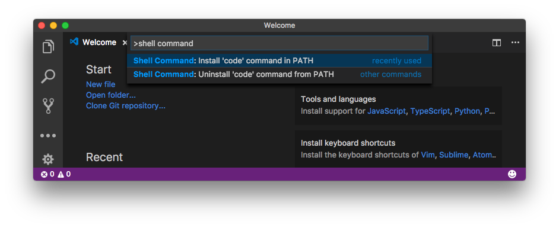

#	Visual Studio Code

##	FAQ

*	__How to open vscode in command line?__  
	```bash
	# Open command palette via,
	# 1. Shift + Command + P, or
	# 2. menu View > Command Palette

	# Then, choose
	# Shell command: Install 'code' command in PATH

	# Then, run in terminal.
	code
	```
	
